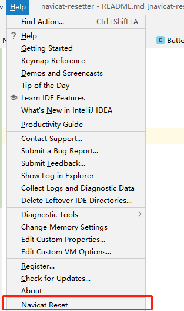
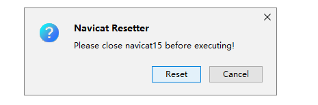

# navicat-resetter

跨平台且易用的Navicat产品重置试用期的IDEA插件

---

## Support

- windows
    - navicat for mysql 15x
- mac(暂不支持)
- linux(暂不支持)

---
## Usage





---
## Development

### Environment
 - Gradle
 - Groovy


### Run

```
gradle runIde
```


### Build Plugin
```
gradle buildPlugin
```

## IDEA Docs
```
    https://plugins.jetbrains.com/docs/intellij/plugin-content.html
```
